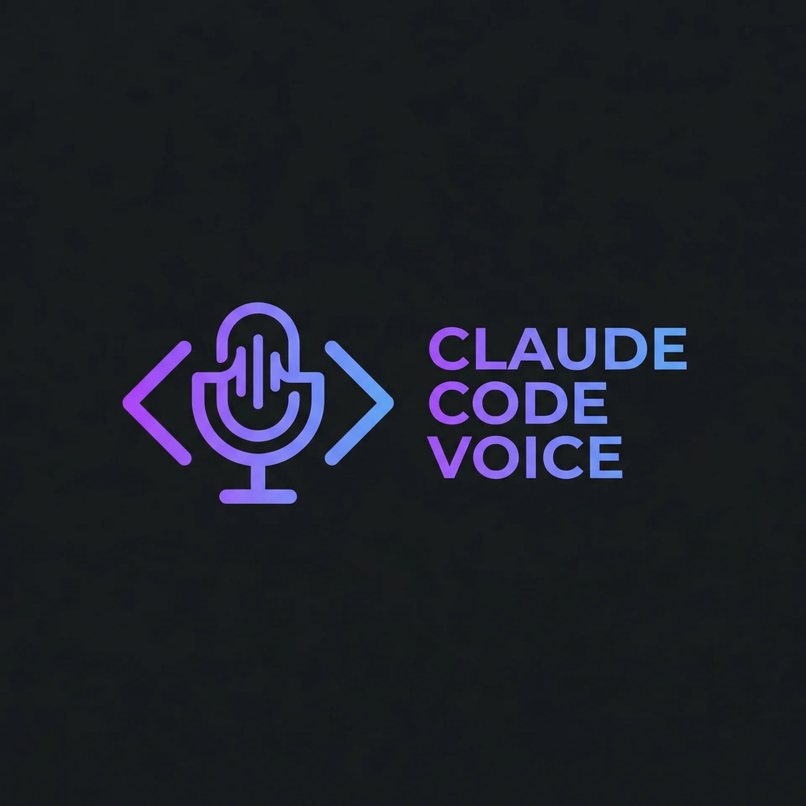

<p align="center">
  
</p>

# Claude Code Voice (macOS)

Adds native speech-to-text to Claude Code's `/voice` command using Apple's `SFSpeechRecognizer`. Claude-native languages are proxied to Anthropic's voice server, while unsupported languages (Hebrew, Arabic, etc.) are transcribed locally with Apple STT. No API keys, no binary patching — survives Claude Code updates.

## Quick install

```bash
curl -fsSL https://raw.githubusercontent.com/dr-data/claude-code-voice/main/setup.sh | bash
```

## Requirements

- macOS (Apple Silicon or Intel)
- Xcode Command Line Tools (`xcode-select --install`)
- Claude Code with `/voice` support

## Demo

<p align="center">
  
</p>

## Usage

After install, restart Claude Code:

1. `/voice` to enable voice mode
2. Hold **Space** to record
3. Speak
4. Release — transcript appears

> **First run:** macOS will prompt for Speech Recognition permission — click **Allow**.

## Switching languages

Type `/config` in Claude Code to change the language. The voice server picks it up immediately — no restart needed.

### Supported languages

| Language | `/config` value | Backend |
|----------|----------------|---------|
| English | `en` (default) | Anthropic |
| Spanish | `es` | Anthropic |
| French | `fr` | Anthropic |
| German | `de` | Anthropic |
| Japanese | `ja` | Anthropic |
| Korean | `ko` | Anthropic |
| Portuguese | `pt` | Anthropic |
| Italian | `it` | Anthropic |
| Russian | `ru` | Anthropic |
| Hindi | `hi` | Anthropic |
| Indonesian | `id` | Anthropic |
| Polish | `pl` | Anthropic |
| Turkish | `tr` | Anthropic |
| Dutch | `nl` | Anthropic |
| Ukrainian | `uk` | Anthropic |
| Greek | `el` | Anthropic |
| Czech | `cs` | Anthropic |
| Danish | `da` | Anthropic |
| Swedish | `sv` | Anthropic |
| Norwegian | `no` | Anthropic |
| **Hebrew** | `he` | Apple STT |
| **Arabic** | `ar` | Apple STT |
| **Chinese (Mandarin)** | `zh` | Apple STT |
| **Cantonese (Hong Kong)** | `yue` or `zh-hk` | Apple STT |

Any language supported by Apple's `SFSpeechRecognizer` works — the 20 natively supported languages are proxied to Anthropic's server for best quality.

### Cantonese setup

1. In Claude Code, run `/config` and set the language to `yue` (or `zh-hk`, `cantonese`, `廣東話`, `粵語` — all work).
2. Download the Cantonese speech model on macOS so Apple STT can work offline:
   - **System Settings → Keyboard → Dictation**
   - Enable **Dictation**, then open the **Language** dropdown
   - Click **Add Language…** and select **Chinese (Cantonese)**
   - macOS will download the on-device model (~100–200 MB)
3. Once downloaded, restart Claude Code and hold **Space** to speak in Cantonese — transcription runs fully on-device.

## Token usage and local processing

- **Claude-native languages** (shown as `Anthropic` in the table): audio is proxied to Anthropic for transcription, so this path uses Claude's voice backend and may consume tokens/usage.
- **Apple STT languages** (shown as `Apple STT`): transcription is done on your Mac with `SFSpeechRecognizer`, so speech-to-text itself is local.
- In both cases, once text is inserted into Claude Code, your normal chat usage still applies.

## How it works

Claude Code has an undocumented `VOICE_STREAM_BASE_URL` env var that redirects its voice WebSocket. This project runs a native macOS app on `localhost:19876` that acts as a smart router:

- **Native languages** (20) → proxied to Anthropic's voice server with OAuth token from Keychain
- **Other languages** → transcribed locally via Apple's on-device `SFSpeechRecognizer`

```text
┌──────────────┐     audio chunks      ┌──────────────┐
│ Claude Code  │ ────────────────────▶ │ voice-server │
│ /voice + ␣   │ ◀──────────────────── │   (local)    │
└──────────────┘       transcript       └──────┬───────┘
                                               │
                                 ┌─────────────┴─────────────┐
                                 │                           │
                      native Claude language        other language
                                 │                           │
                                 ▼                           ▼
                       Anthropic voice STT          Apple on-device STT
```

Everything is a single Swift binary — WebSocket server, proxy, and speech recognition combined. No external runtimes needed.

## Uninstall

```bash
curl -fsSL https://raw.githubusercontent.com/dr-data/claude-code-voice/main/uninstall.sh | bash
```

## Project structure

```
├── setup.sh              # One-command install
├── uninstall.sh           # Full uninstall
└── scripts/
    └── server.swift       # WebSocket server + proxy + Apple STT (single file)
```
